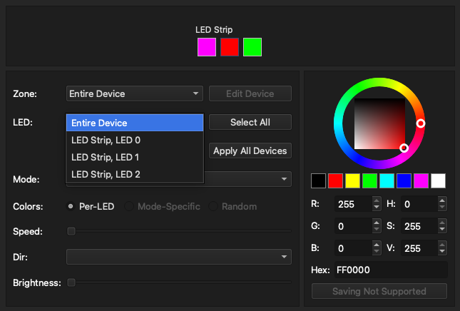

# OpenRGB support for USB Mini Keyboards with CH552G

## Features
- F14-F19 keybind configuration:
    - F14: Button 1
    - F15: Button 2
    - F16: Button 3
    - F17: Encoder clockwise
    - F18: Encoder counter-clockwise
    - F19: Encoder button
- OpenRGB support (through the Adalight serial protocol)
- Each button's LED will light up white when pressed, and return to the Adalight color when released
- The default LED state is off

## Preview



## What's Inside

The core of the board features a wch-ic CH552G microcontroller, three buttons, a rotary encoder, and three addressable LEDs.


## CH552G microcontroller


## How to Build
This firmware uses the Arduino platform to simplify the build process.

1. Install the Arduino IDE.
2. Add support for CH552G:
   - Go to Preferences -> Additional Board Manager.
   - Add https://raw.githubusercontent.com/DeqingSun/ch55xduino/ch55xduino/package_ch55xduino_mcs51_index.json.
3. Open the project `CH552G-Keypad-OpenRGB.ino`.
   - In the Tools menu, select CH55xDuino board.
   - In Tools, select bootloader: P3.6 (D+) Pull up.
   - In Tools, select clock source: 16MHz (internal) 3.5V or 5V.
   - In Tools, select upload method: USB.
   - In Tools, select USB Setting: USER CODE w/266B USB RAM.
4. Compile the project.
5. Set the keyboard in bootloader mode (see below).
6. Flash the project. (*Original firmware will be completed lost*)

## OpenRGB lighting
The firmware enumerates as a USB keyboard plus a CDC serial device. It accepts
Adalight frames for exactly three LEDs:

```text
Ada <count high> <count low> <checksum> <R><G><B>...
```

OpenRGB's built-in serial controller sends the count as `0x0003` for this
keypad. The checksum is `count high ^ count low ^ 0x55`. The nine RGB bytes
are sent in LED order, from LED 1 through LED 3.

In OpenRGB, add the keypad through **Manually Added Devices -> Serial Device**:

- Port: the keypad's serial port
- Baud: `115200`
- LED count: `3`
- Protocol: `Adalight`

On macOS, use the `/dev/cu.usbmodem...` port rather than the corresponding
`/dev/tty.usbmodem...` port when both are available.

The **LED Strip** detector must remain enabled in OpenRGB's detector settings.
This detector is also responsible for loading manually added Adalight devices.
Other hardware detectors can be disabled, but disabling **LED Strip** prevents
the keypad from appearing in the Devices list.

The keyboard interface remains available at the same time. For testing without
OpenRGB, run `./test_adalight.py <serial-port>` from the repository root and
press Ctrl+C to stop it.

## Setting up the Keyboard in Bootloader Mode
To enter bootloader mode, CH552G require connect pin P3.6 to vcc with a 10K pull-up resistor. To do this:
- Short the R12 on the bottom of the board and connect the board to your PC.
  
- You can now proceed to flash the firmware.
- Once the firmware is successfully flashed, to *return to bootloader mode, reconnect the USB interface while either pressing the encoder button or in running mode simultaneously press all the buttons*.

```C
  // Go in bootloader more if connected with encoder button pressed
  if (!digitalRead(PIN_BTN_ENC))
  {
    NEO_writeHue(0, NEO_CYAN, NEO_BRIGHT_KEYS); // set led1 to cyan
    NEO_writeHue(1, NEO_BLUE, NEO_BRIGHT_KEYS); // set led2 to blue
    NEO_writeHue(2, NEO_MAG, NEO_BRIGHT_KEYS); //  set led3 to magenta
    NEO_update();                              // update pixels
    BOOT_now();     // jump to bootloader
  }
```

## Pinout
- BUTTON 1: P16
- BUTTON 2: P17
- BUTTON 3: P11
- BUTTON R: P33
- ENCODER A: P31
- ENCODER B: P30
- LED: P34

## Additional resources
- [RGB Macropad Custom Firmware](https://hackaday.io/project/189914-rgb-macropad-custom-firmware)
- [CH552G Macropad Plus](https://oshwlab.com/wagiminator/ch552g-macropad-plus)
- [ch554_sdcc on GitHub](https://github.com/Blinkinlabs/ch554_sdcc)
- [ch55xduino on GitHub](https://github.com/DeqingSun/ch55xduino)
- [CH552G Product Page](https://www.esclabs.in/product/ch552g-8-bit-usb-device-microcontroller/)
- [LCSC Product Page](https://www.lcsc.com/product-detail/Microcontroller-Units-MCUs-MPUs-SOCs_WCH-Jiangsu-Qin-Heng-CH552G_C111292.html?utm_source=digipart&utm_medium=cpc&utm_campaign=CH552G)
- [CH552G Datasheet](http://www.wch-ic.com/downloads/file/309.html)

## Credits
- [eccherda](https://github.com/eccherda/ch552g_mini_keyboard) - Original Arduino firmware
- [madcock](https://github.com/madcock/ch552g_mini_keyboard) - General fixes and improvements

# License


This work is licensed under Creative Commons Attribution-ShareAlike 3.0 Unported License. 
(http://creativecommons.org/licenses/by-sa/3.0/)
